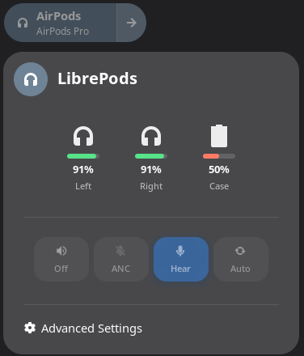

# LibrePods GNOME

AirPods integration for GNOME Shell on Linux. This project provides full support for Apple AirPods features including battery status, noise control modes, and automatic media pause on ear detection.




## Features

- **Battery monitoring** - Real-time battery levels for left pod, right pod, and charging case
- **Noise control modes** - Switch between Off, ANC, Transparency, and Adaptive modes
- **Long press customization** - Configure which noise control modes cycle on stem long press
- **Ear detection** - Automatic media pause/resume when removing/inserting AirPods
- **Quick Settings integration** - Native GNOME Shell Quick Settings panel
- **Model detection** - Automatic detection of AirPods model with feature adaptation
- **Per-device settings** - Settings are saved individually for each paired AirPods

### Supported Models

| Model | Battery | ANC | Transparency | Adaptive |
|-------|---------|-----|--------------|----------|
| AirPods 1st/2nd Gen | ✓ | - | - | - |
| AirPods 3rd Gen | ✓ | - | - | - |
| AirPods 4th Gen | ✓ | - | - | - |
| AirPods 4th Gen (ANC) | ✓ | ✓ | ✓ | ✓ |
| AirPods Pro | ✓ | ✓ | ✓ | - |
| AirPods Pro 2 | ✓ | ✓ | ✓ | ✓ |
| AirPods Max | ✓ | ✓ | ✓ | - |

## Architecture

The project consists of two components:

1. **librepods-daemon** - A C daemon that communicates with AirPods via Bluetooth L2CAP and exposes state via D-Bus
2. **GNOME Shell Extension** - A JavaScript extension that displays AirPods status in Quick Settings

## Requirements

### Build Dependencies

```bash
# Debian/Ubuntu
sudo apt install meson ninja-build libglib2.0-dev libbluetooth-dev

# Fedora
sudo dnf install meson ninja-build glib2-devel bluez-libs-devel

# Arch Linux
sudo pacman -S meson ninja glib2 bluez-libs
```

### Runtime Dependencies

- GNOME Shell 45 or later
- BlueZ (Bluetooth stack)
- AirPods paired via Bluetooth settings

## Installation

### 1. Build and Install the Daemon

```bash
cd daemon
meson setup build
ninja -C build
sudo ninja -C build install
```

### 2. Enable the Systemd User Service

```bash
systemctl --user enable --now librepods-daemon.service
```

### 3. Install the GNOME Shell Extension

```bash
# Copy extension to GNOME Shell extensions directory
cp -r extension ~/.local/share/gnome-shell/extensions/librepods@librepods.org

# Enable the extension
gnome-extensions enable librepods@librepods.org
```

### 4. Restart GNOME Shell

- **X11**: Press `Alt+F2`, type `r`, press Enter
- **Wayland**: Log out and log back in

## Usage

1. Pair your AirPods via GNOME Bluetooth settings
2. Connect your AirPods
3. The LibrePods indicator will appear in the Quick Settings panel
4. Click to expand and see battery levels and noise control options

### Ear Detection & Media Control

By default, media will automatically pause when you remove one or both AirPods from your ears, and resume when you put them back in.

## Uninstallation

```bash
# Stop and disable the daemon
systemctl --user disable --now librepods-daemon.service

# Remove the daemon
sudo ninja -C daemon/build uninstall

# Remove the extension
rm -rf ~/.local/share/gnome-shell/extensions/librepods@librepods.org

# Restart GNOME Shell
```

## Troubleshooting

### Daemon not starting

Check the daemon logs:
```bash
journalctl --user -u librepods-daemon.service -f
```

### Extension not appearing

1. Ensure the extension is enabled:
   ```bash
   gnome-extensions list | grep librepods
   ```

2. Check for extension errors:
   ```bash
   journalctl -f /usr/bin/gnome-shell
   ```

### AirPods not detected

1. Ensure AirPods are paired and connected via Bluetooth
2. Check if the daemon detects the device:
   ```bash
   journalctl --user -u librepods-daemon.service | grep -i airpods
   ```

## Development

### Testing the Daemon

```bash
# Run daemon in foreground with debug output
G_MESSAGES_DEBUG=all ./daemon/build/librepods-daemon
```

### D-Bus Interface

The daemon exposes its interface at `org.librepods.Daemon` on the session bus:

```bash
# Get battery levels
gdbus call --session --dest org.librepods.Daemon \
  --object-path /org/librepods/AirPods \
  --method org.freedesktop.DBus.Properties.Get \
  org.librepods.AirPods1 BatteryLeft

# Set noise control mode
gdbus call --session --dest org.librepods.Daemon \
  --object-path /org/librepods/AirPods \
  --method org.librepods.AirPods1.SetNoiseControlMode "anc"
```

## Credits

This project is based on the protocol reverse-engineering work from the [LibrePods](https://github.com/kavishdevar/librepods) project by Kavish Devar.

## License

This project is licensed under the GNU General Public License v3.0 - see the [LICENSE](LICENSE) file for details.